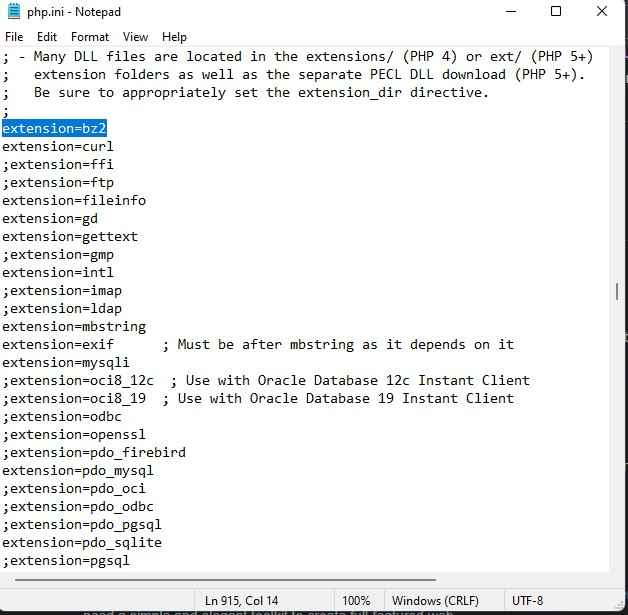
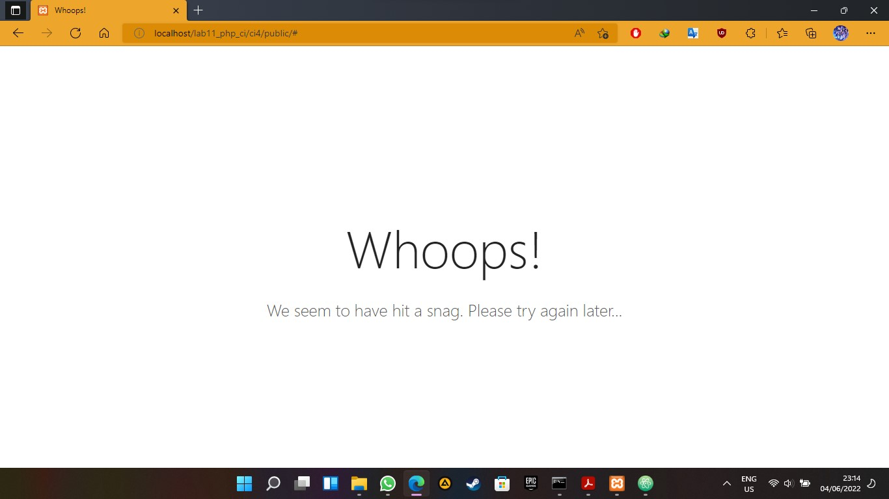

# Lab11Web
bagus tri handono 
312010170 
20.TI.B1 
Praktikum 11: PHP Framework (Codeigniter) 
_____________________________________________________________________________
1.pertama setting file php.ini di XAMPP control panel seperti digambar bawah 
 
2.lalu unduh codeigniter lalu ekstrak di folder htdocs/lab11_php_ci4 
3.lalu buka file env menjadi .env lalu ubah nilai konfigurasi pada environment variable CI_ENVIRINMENT menjadi development. 
4.jika terjadi kesalahan pada konfigurasi maka akan terjadi kesalahan saat dibrowser seperti gamabar dibawah 
 

